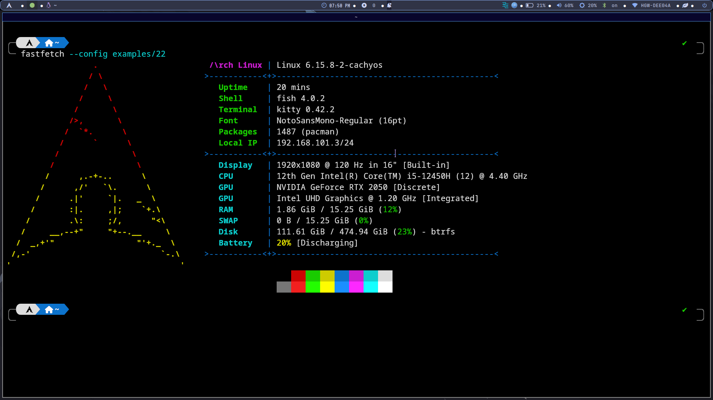

⚡ i3wm-dots

    My customized i3 Window Manager dotfiles
    Powered by modules, scripts, and minimalism

A sharp, script-driven i3wm setup for productivity and style lovers. Take your Linux desktop to the next level with carefully selected tools and tweaks!
🏆 Features

    Polybar with interactive modules (network manager, etc.)

    Integrated dmenu and rofi scripts for launching apps, wifi/Bluetooth control, and power menu

    Clean notifications, clipboard management, and brightness control

    Lightweight, fast, and easy to maintain

🛠️ Dependencies
Component/Function	Package/Script Name
Window Manager	i3wm
Bar	polybar (networkmanager module)
Launcher	dmenu, rofi (custom scripts)
Bluetooth & WiFi	rofi-bluetooth, rofi-wifi scripts
Power Menu	rofi-powermenu script
Notifications	dunst
Brightness Control	brightnessctl
Clipboard Manager	parcellite
🚀 Quick Preview

🛠️ Other Dependencies
playerctl picom bc numlockx
betterlockscreen for screenlock

Add a screenshot or GIF here to show off your desktop!

text

⚡ Getting Started

    Install the dependencies listed above using your distro’s package manager.

    Clone this repository:

bash
git clone https://github.com/yourusername/i3wm-dots.git ~/.config/i3

Copy and symlink config/scripts as needed:

bash
cp -r ~/.config/i3/* ~/.config/
cp -r ~/.config/networkmanager_dmenu ~/.config/
cp -r ~/.config/polybar ~/.config
cp -r ~/.config/rofi ~/.config

Ensure scripts (in scripts/ folder) are executable:

    bash
    chmod +x ~/.config/i3/scripts/*

    Restart i3 or your session and enjoy!

🔗 Custom Scripts

    Rofi-Launcher: Fast and flexible app launcher

    Rofi-Wifi: Quick Wi-Fi selection & connect

    Rofi-Bluetooth: Toggle/connect Bluetooth devices easily

    Rofi-Powermenu: Shutdown, reboot, suspend, and logout via rofi

Scripts can be found in the scripts/ directory—make them executable and update your i3 config accordingly!
🤝 Credits

    Polybar modules inspired by various GitHub users

    Big ups to open source maintainers & script authors

